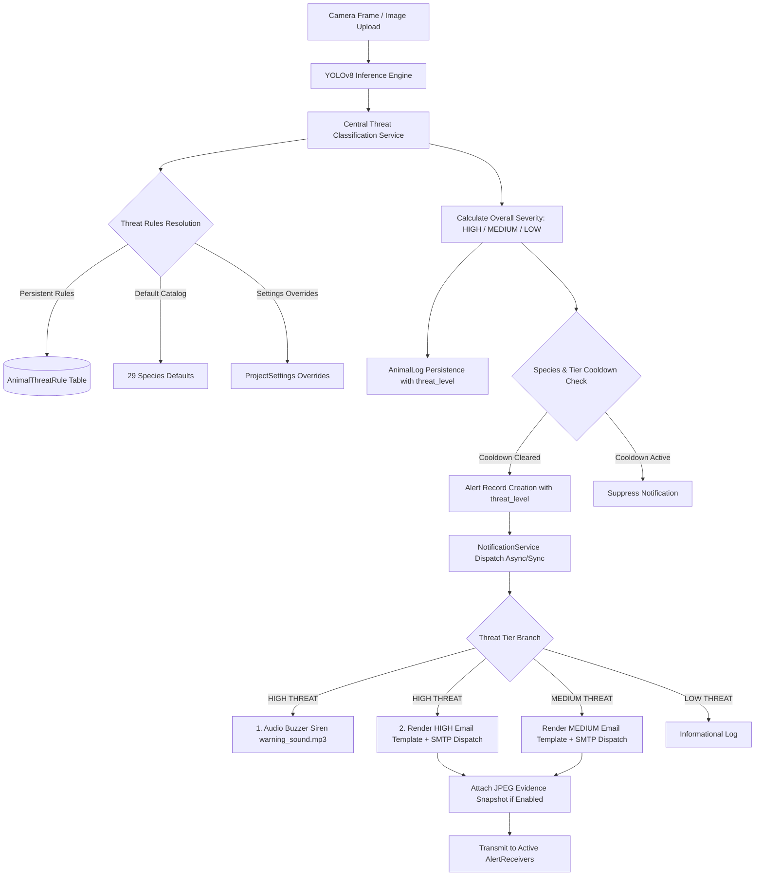

# Step 21 — Animal Threat Classification & Notification Architecture

## 1. System Architecture Overview

---

## 2. Threat Hierarchy & Classification Matrix

| Threat Tier | Numeric Priority | Default Species Examples | System Response Policy |
| :--- | :---: | :--- | :--- |
| **HIGH** | `3` | Bear, Elephant, Lion, Tiger, Cheetah, Leopard, Wolf, Hyena, Crocodile, Snake, Hippo | Hardware audio buzzer siren (`warning_sound.mp3`) + Priority SMTP email notification with attached evidence snapshot |
| **MEDIUM** | `2` | Dog, Cow, Horse, Sheep, Zebra, Giraffe, Monkey, Fox, Deer, Jackal, Kangaroo, Wild Boar | SMTP email notification with attached evidence snapshot |
| **LOW** | `1` | Bird, Cat, Squirrel, Penguin, Eagle, Owl, Mouse, Rat | Informational logging (`AnimalLog`) and log-only alert |
| **UNKNOWN** | `2` | Any uncataloged species fallback | Safe default to `MEDIUM` threat tier |

---

## 3. Data Models

### 3.1 `AnimalThreatRule` (`settings_app_animalthreatrule`)
- `animal_name`: Unique lowercase species identifier (e.g. `'tiger'`).
- `threat_level`: `'HIGH'`, `'MEDIUM'`, or `'LOW'`.
- `is_active`: Boolean flag enabling/disabling the classification rule.

### 3.2 `ThreatEmailTemplate` (`settings_app_threatemailtemplate`)
- `threat_level`: Unique key (`'HIGH'`, `'MEDIUM'`, `'LOW'`).
- `subject_template`: Django template string for email subject.
- `body_template`: Django template string for email body.
- `is_active`: Boolean flag.

### 3.3 `AnimalLog` & `Alert` Enhancements
- `AnimalLog.threat_level`: Indexed string field (`'HIGH'`, `'MEDIUM'`, `'LOW'`).
- `Alert.threat_level`: Indexed string field (`'HIGH'`, `'MEDIUM'`, `'LOW'`).
- `Alert.email_sent`: Boolean tracking email dispatch status.
- `Alert.buzzer_triggered`: Boolean tracking hardware siren status.
- `ProjectSettings.attach_alert_image_to_email`: Boolean toggle to include snapshot evidence JPEGs.

---

## 4. Evidence Management & REST Endpoints

1. **Evidence Download**:
   - `GET /api/v1/alerts/<id>/download/`
   - Enforces authentication and path traversal protection against `MEDIA_ROOT`.
   - Returns attachment stream with filename `alert_<id>_<animal>_<timestamp>.jpg`.

2. **Authorized Deletion (Option B)**:
   - `DELETE /api/v1/alerts/<id>/`
   - Non-staff users receive HTTP 403 Forbidden.
   - Staff/Admin users delete the `Alert` record and safely remove unreferenced snapshot files from disk.

3. **Live Template Preview**:
   - `POST /api/v1/settings/email-templates/preview/`
   - Renders context dictionary server-side using sample parameters without transmitting real emails.
